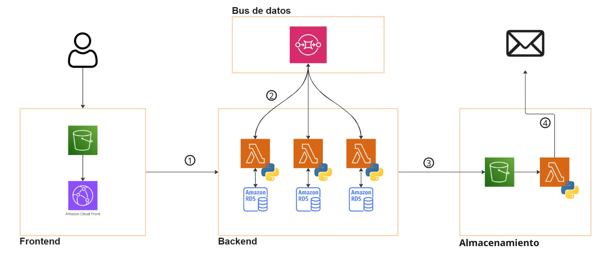

# Sistema de Gestión de Siniestros Serverless en AWS

Este proyecto implementa un sistema de gestión de siniestros de vehículos utilizando una arquitectura serverless basada en Amazon Web Services (AWS). El sistema permite a los usuarios registrar siniestros, consultar el estado de sus órdenes y recibir automáticamente la factura generada al finalizar el proceso.

### Tecnologías y Servicios

- Frontend: Amazon S3 para contenido estático y Amazon CloudFront como CDN.
- Backend: Tres microservicios implementados con AWS Lambda, cada uno con su propia base de datos Amazon RDS.
- Comunicación: Amazon SQS para el intercambio asíncrono de mensajes entre microservicios.
- Notificaciones: Lambda que detecta documentos en S3 y envía correos electrónicos a los usuarios.

### Funcionalidad

- Registro de siniestros a través del frontend.
- Creación y almacenamiento de órdenes en el microservicio principal (Orden).
- Cálculo del coste de reparación en un microservicio independiente.
- Generación de facturas cuando se cumplen ciertas condiciones, almacenadas en S3.
- Notificación automática al usuario vía correo electrónico cuando la factura está disponible.

### Características

- Arquitectura modular y escalable.
- Comunicación desacoplada entre microservicios.
- Alta disponibilidad y tolerancia a fallos.
- Procesamiento completamente serverless, reduciendo costos de infraestructura.

